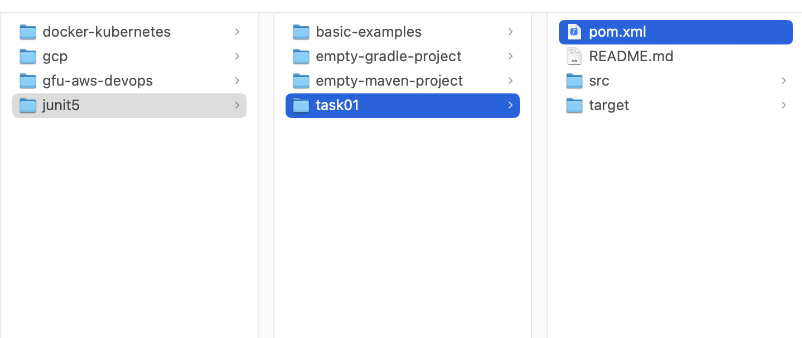
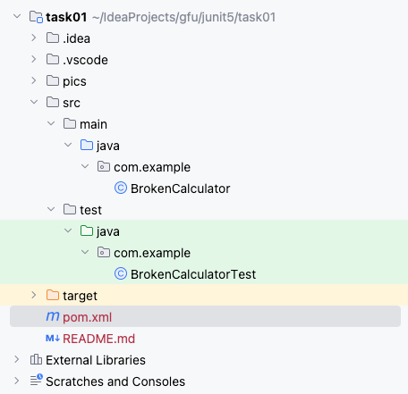
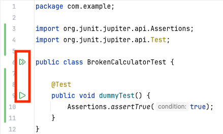

# Aufgabe: Fehler in der Calculator-Klasse finden und beheben

Die [BrokenCalculator-Klasse](src/main/java/tech/erben/BrokenCalculator.java)
enthält kleine Fehler, die während der Implementierung entstanden sind.
Ihre Aufgabe ist es:

1. JUnit 5-Tests zu erstellen: Schreiben Sie Testfälle für jede Methode,
   um alle Fehler in der Klasse zu identifizieren.
2. Fehler zu beheben: Sobald die Fehler durch die Tests gefunden wurden,
   korrigieren Sie die BrokenCalculator-Klasse.

Hinweise:

- Die Methode `add` sollte zwei Ganzzahlen korrekt addieren.
- Die Methode `subtract` sollte zwei Ganzzahlen korrekt subtrahieren.
- Die Methode `multiply` sollte zwei Ganzzahlen korrekt multiplizieren.
- Die Methode `divide` sollte eine Division durchführen und eine
  `IllegalArgumentException` werfen, wenn der Divisor null ist.
- Die Methode `square` sollte das Quadrat einer Ganzzahl berechnen.
- Die Methode `squareRoot` sollte die Quadratwurzel einer Zahl berechnen
  und eine `IllegalArgumentException` werfen, wenn die Zahl negativ ist.

## Setup-Hinweise

### Für IntelliJ IDEA

Starten Sie IntelliJ IDEA und wählen den "Open"-Knopf, um ein neues
Projekt zu öffnen.

Wählen Sie danach die [pom.xml](pom.xml) im Dateibrowser aus. Sie
befindet sich im task01-Verzeichnis des Code-Repositories.

Bestätigen Sie, dass Sie die Datei als Projekt öffnen wollen.

Nach einiger Zeit ist das Maven-Projekt geladen und der Dateibrowser
sollte wie folgt (oder ähnlich) aussehen:

Einen Testfall in der Klasse
[BrokenCalculatorTest.java](src/test/java/tech/erben/BrokenCalculatorTest.java)
können Sie ausführen, indem Sie auf das Play-Symbol einer Methode
klicken, die mit `@Test` annotiert ist.

